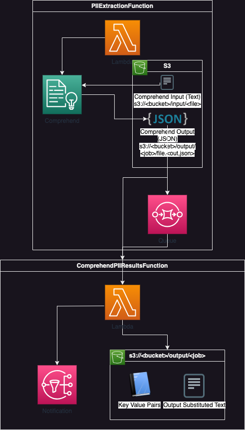

<h1 align="center">PII Substiter</h1>
<p align="center">A tool to remove personal identifiable information (PII) from legal documents for privacy in processing by third party services. Made with AWS.</p>

<details>
  <summary>Table of Contents</summary>
  <ol>
    <li>
      <a href="#about">About</a>
      <ul>
        <li><a href="#built-with">Built With</a></li>
      </ul>
    </li>
    <li>
      <a href="#getting-started">Getting Started</a>
      <ul>
        <li><a href="#prerequisites">Prerequisites</a></li>
        <li><a href="#installation">Installation</a></li>
      </ul>
    </li>
    <li><a href="#usage">Usage</a></li>
    <li><a href="#roadmap">Roadmap</a></li>
    <li><a href="#contribution">Contribution</a></li>
  </ol>
</details>

## About
This was a project started in May of 2023 for a three week internship at DocLens. This is my first time using AWS to complete a project from start to finish. 

### Built With
- AWS Comprehend
- AWS S3
- AWS Transcribe
- AWS SQS
- AWS SNS
- AWS Lambda



## Getting Started

### Prerequisites

Install the AWS ClI:
1. `curl "https://awscli.amazonaws.com/AWSCLIV2.pkg" -o "AWSCLIV2.pkg"`
2. Replace /target with wherever you want to install the package <br>
`sudo installer -pkg ./AWSCLIV2.pkg -target /target`

### Installation
1. Clone the repo <br>
`git clone https://github.com/vivanpoddar/doclens_pii_redaction.git`
2. Sign in through the AWS CLI. You will need to create a secret access key in the AWS management console.
`aws configure`
3. Deploy the sam template. This will create all the required AWS resources in your account. <br>
`sudo ./deploy.sh`

## Usage

### Run

###### Create an event
In the AWS Console, create an event with the following parameters in PIIExtractionFunction:

```
{
  "UI_TOPIC_ARN": "",
  "S3OUTPUTURI": "",
  "S3INPUTURI": ""
}
```
The topic ARN will be used for sending a notification when the second lambda is completed.<br>
Once finished, run the event and the output will end up in the S3OUTPUTURI.

### Examples

###### Input: 
s3://piidata/input/input.txt <br>
`Hello Paulo Santos. The latest statement for your credit card account 1111-0000-1111-0000 was mailed to 123 Any Street, Seattle, WA 98109`

###### Output:
Key Value Pairs: s3://piidata/output/<job>/input.txt.subst.txt <br>
`{"John Doe0": "Paulo Santos", "5555-5555-5555-1000": "1111-0000-1111-0000", "100 DocLens Steet; New York; NY 10024": "123 Any Street, Seattle, WA 98109"}` <br><br>
Substituted Text: s3://piidata/output/<job>/input.txt <br>
`Hello John Doe0. The latest statement for your credit card account 5555-5555-5555-1000 was mailed to 100 DocLens Steet; New York; NY 10024`

## Roadmap
- [x] PII Extraction
- [x] Text processing
- [x] Speech to text
- [ ] PII Extraction from transcribed text
- [ ] Personal Health Information (PHI)

## Contribution
Thanks a lot to my father for teaching me and helping me get started with using AWS. 